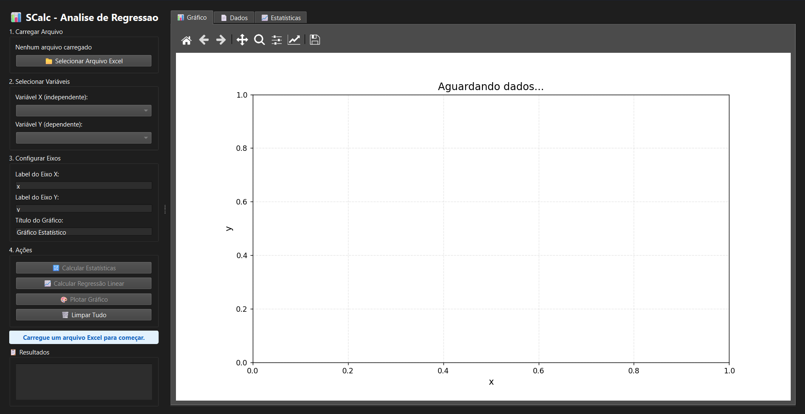
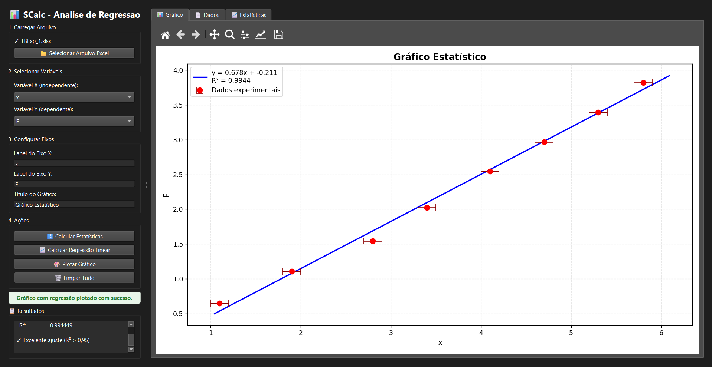

# SCalc — Guia do Usuário

Bem-vindo ao SCalc! Este guia mostra tudo que você precisa saber para usar o programa do início ao fim, sem precisar saber programação e até mesmo sem saber estatística (uau!).

---

## O que o SCalc faz?

O SCalc recebe uma planilha Excel com medições experimentais e, a partir dela:

1. Calcula a **média** de cada medição e os **erros** associados
2. Traça a **reta que melhor representa** a relação entre duas grandezas (regressão linear)
3. Gera um **gráfico** com os pontos, as barras de erro e a reta ajustada

Incrível, não?

---

## Antes de começar: preparando sua planilha

O SCalc espera um formato específico de planilha. Montar a tabela corretamente é parte fundamental da correta utilização do software, então abaixo está tudo o que você precisa saber para começar (relaxa, não é nada difícil, pode confiar).

### Estrutura da tabela

Sua planilha deve ter as seguintes colunas, **necessariamente nesta ordem de colunas**:

| Dados | I\_err | 1    | 2    | 3    |
|-------|--------|------|------|------|
| a\_1  | 0.05   | 1.20 | 1.25 | 1.18 |
| a\_2  | 0.05   | 2.30 | 2.28 | 2.35 |
| a\_3  | 0.05   | 3.40 | 3.38 | 3.42 |
| b\_1  | 0.10   | 2.41 | 2.45 | 2.39 |
| b\_2  | 0.10   | 4.60 | 4.65 | 4.58 |
| b\_3  | 0.10   | 6.90 | 6.95 | 6.88 |
| c\_1  | 0.15   | 7.12 | 7.20 | 6.96 |
| c\_2  | 0.15   | 8.93 | 9.07 | 9.01 |
| c\_3  | 0.15   | 9.78 | 9.86 | 9.86 |

### O que significa cada coluna

**Coluna `Dados`** — identifica cada ponto de medição. O nome tem duas partes: uma letra (ou palavra) que representa a grandeza do dado medido, e um número que representa qual ponto é esse. Os dois são  (e precisam ser) separados por `_`.

- `a_1`, `a_2`, `a_3` são três pontos da grandeza `a`
- `b_1`, `b_2`, `b_3` são três pontos da grandeza `b`
- `c_1`, `c_2`, `c_3` são três pontos da grandeza `c`
- Você pode usar qualquer nome: `tensao_1`, `corrente_2`, `temperatura_3`, etc.

**Coluna `I_err`** — o erro do instrumento usado para medir aquele ponto. Por exemplo, se o seu voltímetro tem precisão de ±0,05 V, coloque `0.05`. Cada linha pode ter um erro diferente, pois o instrumento de medida (e consequentemente sua precisão) pode variar, por exemplo, se eu estiver medindo um ponto com um paquímetro (erro de ±0,05 mm) e outro com um micrômetro (erro de ±0,01 mm).

**Colunas `1`, `2`, `3`, ...** — as repetições da medição. Se você mediu o mesmo ponto três vezes, cada medição vai em uma coluna. O SCalc calcula automaticamente a média e o espalhamento entre elas. Então se eu calculei o tempo de queda de uma massa de uma mesma altura fixa 5 vezes, são 5 colunas que devo colocar.

### Regras importantes

- A coluna de identificação **deve** ter o nome `Dados` (o programa a detecta pelo nome)
- A coluna de erro **deve** conter a palavra `err` (ou `error` / `erro`) **e** a letra `i` em algum lugar do nome. Exemplos válidos: `I_err`, `i_error`, `xerr_instr`
- Você pode ter quantas colunas de repetição quiser — o programa usa todas
- Células em branco nas colunas de repetição são ignoradas (cada ponto pode ter um número diferente de medições)
- Você precisa de **pelo menos dois grupos diferentes** (ex: `a` e `b`) para calcular a regressão

### Exemplo com três grandezas

Se o seu experimento mediu três grandezas (por exemplo, tempo, distância e temperatura), você pode ter grupos `t`, `d` e `T` na coluna `Dados`. Na hora de calcular a regressão, você escolhe quais duas quer comparar.

---

## Abrindo o programa

Existem duas principais maneiras de utilizar o software, pelo terminal e pelo executável. No segundo caso a janela é aberta automaticamente, mas no caso do terminal, é necessário que execute:

```
python scalc.py
```

A janela que abre é dividida em dois painéis:



O painel esquerdo tem os controles. O painel direito mostra o gráfico, os dados e as estatísticas em abas separadas. Você pode arrastar a divisória entre os dois painéis para redimensioná-los.

---

## Passo a passo

### Passo 1 — Carregar o arquivo

Clique no botão **📁 Selecionar Arquivo Excel** e navegue até sua planilha `.xlsx`. Quando o arquivo carregar com sucesso, você verá o nome dele no painel e os dados brutos aparecerão na aba **📄 Dados**.

> Se aparecer uma mensagem de erro, verifique se o arquivo está no formato `.xlsx` e se não está aberto em outro programa.

---

### Passo 2 — Calcular estatísticas

Em 'Ações', clique em **🔢 Calcular Estatísticas**.

O programa vai:
- Identificar os grupos na coluna `Dados` (ex: `a` e `b`)
- Calcular a média de cada ponto usando todas as repetições
- Calcular o erro estatístico (o quanto as repetições variaram)
- Combinar o erro estatístico com o erro instrumental
- Popular os dropdowns de variáveis com os grupos encontrados

As estatísticas completas aparecem na aba **📈 Estatísticas** no painel direito.

---

### Passo 3 — Selecionar as variáveis

Use os dois dropdowns que aparecem em **2. Selecionar Variáveis**:

- **Variável X (independente)** — a grandeza que você quer no eixo horizontal (a causa, a variável que você controla)
- **Variável Y (dependente)** — a grandeza que você quer no eixo vertical (o efeito, a variável que você mede)

Por padrão, o programa seleciona automaticamente o primeiro grupo para X e o segundo para Y.

## Passo 3.5 (Opcional)

Após selecionar as variáveis, já é possível plotar o gráfico.
Para isso, clique no botão **🎨 Plotar Gráfico** e veja a mágica acontecer na aba **📊 Gráfico**!

---

### Passo 4 — Calcular a regressão linear

Clique em **📈 Calcular Regressão Linear**.

No painel de **📋 Resultados** (parte inferior do painel esquerdo) você verá algo como o exemplo abaixo:

```
==================================================
REGRESSÃO LINEAR
==================================================

X: x   |   Y: F
Iterações: 8

y = 0.678187·x + -0.210542

  m (coef. angular): 0.678187
  b (coef. linear):  -0.210542
  R²:                0.994449

✓ Excelente ajuste (R² > 0,95)
```

**O que significa cada número:**

**Equação `y = mx + b`** — a reta que melhor representa seus dados, onde `m` e `b` são os coeficientes angular e linear, respectivamente.

**R² (pronuncia-se "R ao quadrado")** — mede o quão bem a reta se encaixa nos seus pontos. Vai de 0 a 1:

| R² | O que significa |
|---|---|
| acima de 0.95 | Excelente — os pontos estão muito próximos da reta |
| 0.85 a 0.95 | Bom — ajuste confiável |
| 0.70 a 0.85 | Moderado — existe relação linear, mas com dispersão relevante |
| abaixo de 0.70 | Fraco — os dados provavelmente não têm relação linear, ou há muita imprecisão |

---

### Passo 5 — Plotar o gráfico

Clique em **🎨 Plotar Gráfico**. O gráfico aparece na aba **📊 Gráfico**:



Cada ponto tem uma barra de erro horizontal (erro em X) e uma barra vertical (erro em Y), as vezes uma ou outra não são perceptíveis por padrão.

---

## Trabalhando com o gráfico

A barra de ferramentas acima do gráfico permite interagir com ele:

| Botão | O que faz |
|---|---|
| 🏠 **Home** | Volta ao zoom original |
| ◀ **Voltar** | Desfaz o último zoom ou movimento |
| ▶ **Avançar** | Refaz o último zoom ou movimento |
| ✋ **Mover** | Clique e arraste para mover o gráfico |
| 🔍 **Zoom** | Clique e arraste para ampliar uma região específica |
| 💾 **Salvar** | Salva o gráfico como imagem |

### Salvando o gráfico

Ao clicar em **💾 Salvar**, escolha onde salvar e o formato desejado. Os formatos disponíveis são:

- **PNG** — imagem comum, ideal para apresentações e documentos Word
- **PDF** — alta qualidade, ideal para artigos e relatórios
- **SVG** — vetorial, pode ser editado em programas como Inkscape
- **JPG** — comprimido, menor em tamanho
- **EPS** — para editores científicos e LaTeX

---

## Limpando e começando de novo

O botão **🗑️ Limpar Tudo** apaga todos os dados carregados e volta a interface ao estado inicial. Uma janela de confirmação aparece antes de limpar.

---

## Usando pelo terminal (sem interface gráfica)

Se você quer processar um arquivo diretamente, sem abrir a janela, use o modo de linha de comando:

```
python scalc.py --cli --arquivo minha_planilha.xlsx
```

O programa imprime os resultados no terminal e exibe o gráfico em uma janela separada. Para personalizar os rótulos:

```
python scalc.py --cli --arquivo minha_planilha.xlsx --x-label "Tempo (s)" --y-label "Distância (m)"
```

---

## Dúvidas frequentes

**O programa abre mas não aparece nada na tela.**
No Linux, verifique se as dependências gráficas do sistema estão instaladas. Consulte a seção de instalação no README.

**Cliquei em "Calcular Estatísticas" mas os dropdowns de variáveis ficaram vazios.**
O programa não encontrou grupos válidos na coluna `Dados`. Verifique se o nome da coluna é exatamente `Dados` (com D maiúsculo) e se os identificadores seguem o formato `prefixo_número` (ex: `a_1`).

**A mensagem diz "grupos com tamanhos diferentes".**
Os dois grupos selecionados têm quantidades diferentes de pontos. Por exemplo, o grupo `a` tem 3 linhas na coluna `Dados` e o grupo `b` tem 4. Ambos precisam ter o mesmo número de pontos para a regressão funcionar.

**O R² deu muito baixo (abaixo de 0.70).**
Pode ser que os dados não sigam uma relação linear, que haja muita variação entre as repetições, ou que as variáveis X e Y sejam independentes entre si. Tente trocar quais variáveis você está comparando.

**O gráfico não aparece no modo de terminal (CLI).**
Em servidores ou conexões SSH sem interface gráfica, o Matplotlib não consegue abrir uma janela. Nesse caso, você pode salvar o gráfico em arquivo modificando o script ou configurando o backend do Matplotlib.

**O arquivo não carrega.**
Certifique-se de que o arquivo é `.xlsx` (não `.xls` antigo ou `.csv`) e de que não está aberto em outro programa como o Excel.


**Possui outra dúvida?**
Entre em contato pelo github ou pelo email "caioaquilinomerino@gmail.com"